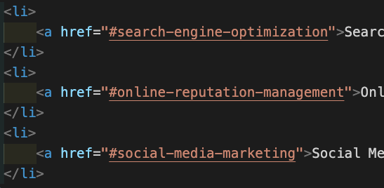
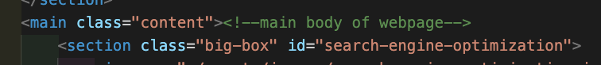
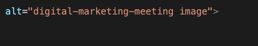
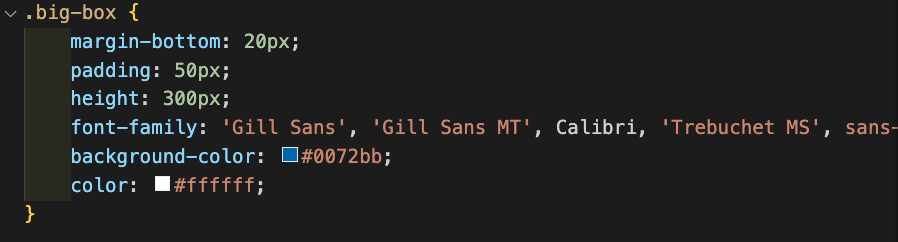

## Table of Contents
  * [License](#License)
  * [Title](#Title)
  * [Description](#Description)
  * [Installation](#Installation)
  * [Usage](#Usage)
  * [Contribution](#Contribution)
  * [Test](#Test)
  * [Technologies](#Technologies)
  * [Questions](#Questions)
  * [Spot-Light](#Spot-Light)
  
  ## License
  
  

  # Code Refactor 
  ### Grant Ellington
  ## Description
  
  This project is to refactor given code to be semantically correct and dry.
  
  ## Installation
  
  NA
  
  ## Usage Information
  
  You can view the page on git hub pages.
  
  ## Contribution 
  
  See the license.
  
  ## Test
  
  na
  
  
  ## Technologies
  Project is created with:
  * HTML
  * CSS
  * NA
  ## Set-up
  
  
  ## Questions
  Grant-Ellington
  [gellingtonem6@gmail.com](gellingtonem6@gmail.com)

  ## Spot-Light

  Items accomplished
  * relinked local link with href and ids  

  * made html elements semantic
  * added alt tags.

  * removed repetition in the CSS file

  
